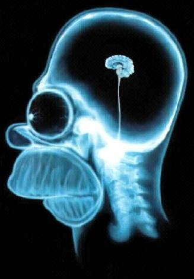
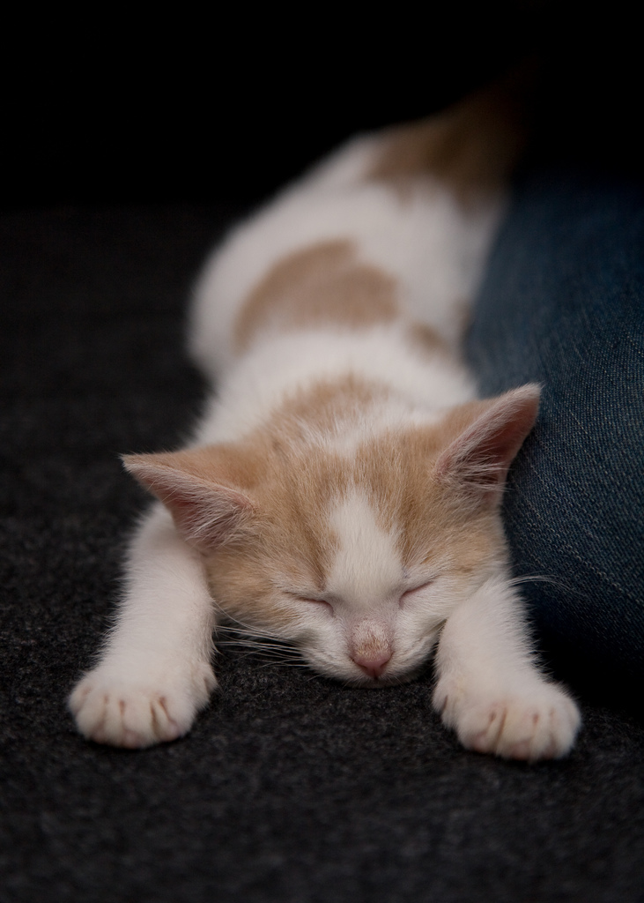
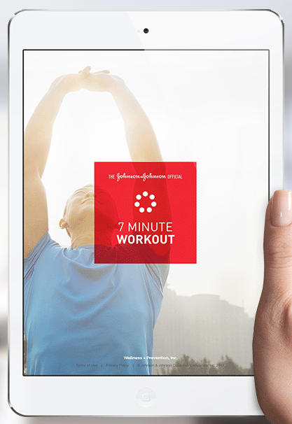
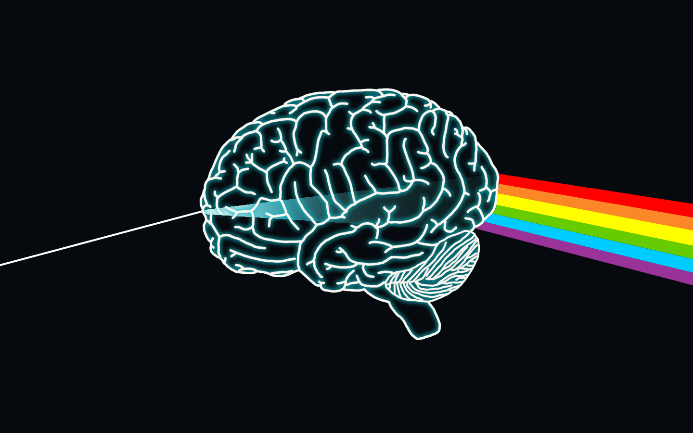
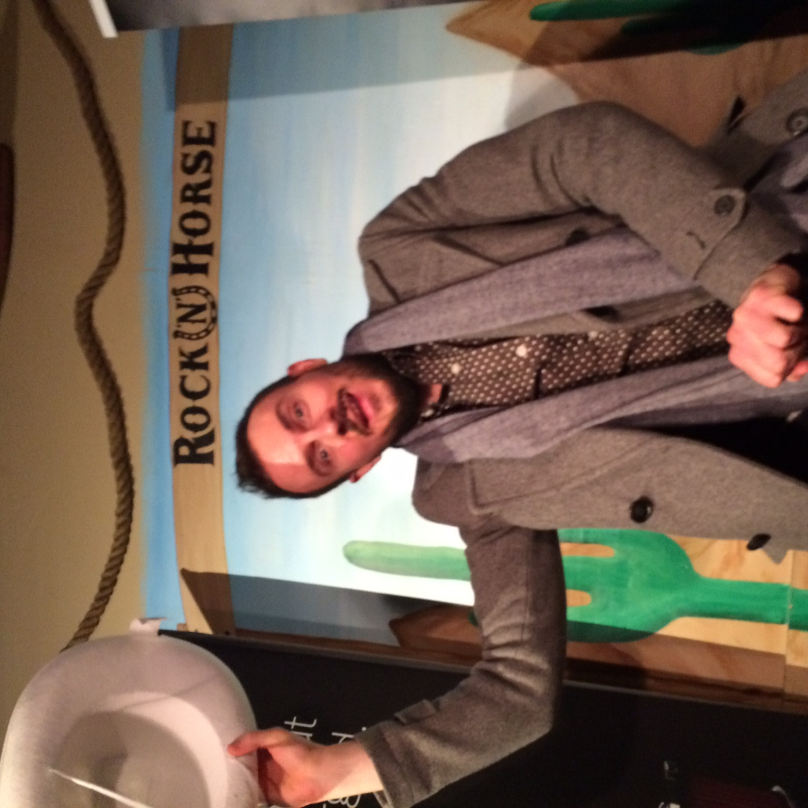

# BRAIN HACKS

^ Acknowledge friends, coworkers, FITC, ladies

^ First time talking, photo

^ Brain work efficiently, stay focused and be more creative

^ I'm going to help you make your brain work for you

^ If you take this on, you will have a whole new mind

---

# ME

^ Moved to Canada from Ukraine with my family, 17 years

^ I'm mostly a developer

^ Although in my freelance days I was doing a lot of design

^ I've been working in the industry for about 10 years now

^ Spend most of my time with code, programming the matrix

^ Mostly self taught

---

---

---

^ I love cooking ... for my dog

^ Public speaking

^ Eating, photography

^ Cycling, meditation, yoga, reading

^ Why did I chose to do a talk about the brain and not on development

^ How do I know this

^ Books, podcasts, research, personal experience

---

# YOUR BRAIN

^ We all use our brains to work

^ Your brain is constantly at work

^ The source of your productivity and creativity and focus

^ Your brain is not meant to survive in today's world

^ Your brain needs your help to function properly

^ I hope you came here because you'd like to improve the way your brain functions

^ Well this won't happen just by listenning to me, you'll have to take actions

^ Your brain will resist any change and when implementing new habits, you need to create structures in your life to stick to your habits

---

# SLEEP

^ Who has had ... ?

^ Lack of sleep will: weaken your immunity, diminish your ability to focus and drain your physical and mental energy

^ Sleep is essential for a healthy and productive brain

^ Sleep restores your phycical energy and helps your brain process and store information as well as create new connections

^ Take naps 

---

# SLEEP

- Dark & quite
- Avoid screens before bed
- Have a ceffeine curfue

---

# EXCERCISE

^ Our bodies and minds are linked together

^ As our bodies lack movement, so too do our minds

^ Healthy and effective brain start with a healthy body

^ Your body needs exercise every day!

^ Just a 7 minute exercise every day can boost your brain's efficiency throught the day

^ Stand at work or take breaks, your body was not designed for sitting

^ Lets stand up and stretch

---

## GO LIFT

- Morning Exercise
- Cardio
- Yoga
- Cycling
- Take breaks from sitting
- Get a standing desk

---

# IMPROVE FOCUS

^ Eliminate distractions

^ Don't try to multitask, you can't do it!

^ A constanct distraction from phone and emails will drop your IQ by 10 points

^ When we switch our attention between different activities, our brain is unable to function effectively. This in turn causes us to make thoughtless mistakes, or forget and misplace things.

^ Keep a clean environment, inside your head and outside, get a junk drawer

^ Write down your thoughts and things you need to do, categorize them

^ Use Evernote

^ Pomodoro technique

^ BOOK: The Organized Mind Daniel J Levitin

---

# MEDITATION

^ I've been practicing mindful meditation for about 5 years now

^ I meditate for at least 5 minutes every morning

^ Meditation helped me focus better, be less reactive and be mindful of the present

^ If you really want to improve your focus, I invite you to start meditating

---

## MEDITATION BENIFITS

- Improves Concentration
- Boosts Creativity
- Decreases Anxiety
- Improves Sleep
- You Gain Clarity

^ Myths: Chanting mantras, hour a day, sitting in lotus position, wearing robe

---

## MEDITATION

> I'm so busy today, that... I'm going to meditate 2 hours instead of 1.

-- Gandhi

---

## GET STARTED

- Mindfulness App
- Simply Being App
- Get Some Headspace App
- Sign up for a meditation course

---

# NUTRITION

- Water

^ Water, helps remove waste and help blood circulation

^ Dehydration will effect your mood and energy levels, you will get headaches and you will find youself unable to concentrate

- Fats

^ Fats help your brain transmit and receive information, and maintain other function like water storage and energy production

- Brain Food

^ Caffeine is good, stay away from sugar

^ Sugar impairs brain function

---

# BRAIN FOODS

- Blueberries
- Avocados
- Nuts and Seeds
- Salmon
- Dark leafy greens
- Whole grains
- Dark Chocolate

---

# CONSERVE YOUR ENERGY

^ Your ability to think and make decisions is a limited resource, so conserve the your resources and focus your energy on things that matter

^ We use a massive amount of energy in all our interactions with the world, which fatigues our ability to think clearly. This indicates that our capacity for active thought is limited.

^ Study in 1898

^ Turn tasks into routines so your brain doesn't use up energy thinking about it

---

# LAUGH :smile:

^ happy brain = productive brain

^ Follow comedians on Instagram/Twitter

^ Prank coworkers

^ Take an improv glass so that you can generate more excitement from everyday life

---

# MY MORNING ROUTINE

- Meditation
- Affirmations
- Exercise
- Write down what I am thankful for
- Write down commitments for the day

---

# CREATIVITY

---

^ Conclusion

^ You are constantly using your brain, from basic activities like walking and eating to creating wonderful things

^ Your brain is a complicated machine, and it needs your help to perform optimally, including good nutrition and rest. 

^ Be good to your brain, and it will be good to you!

---

# BOOKS

- **Sleep Smarter: 21 Proven Tips** by Shawn Stevenson

---

# THANK YOU

max@maxtherocket.com
@maxtherocket
